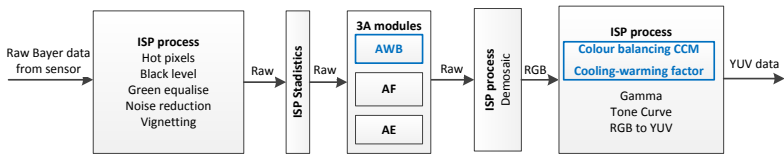
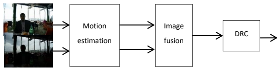
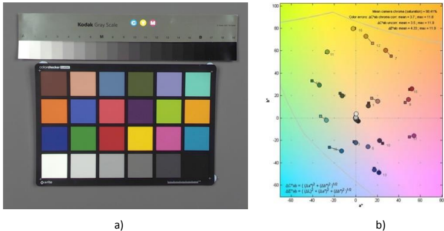
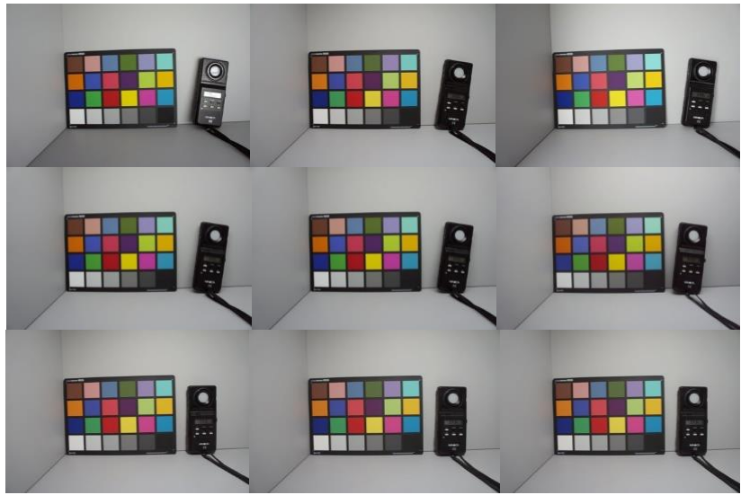
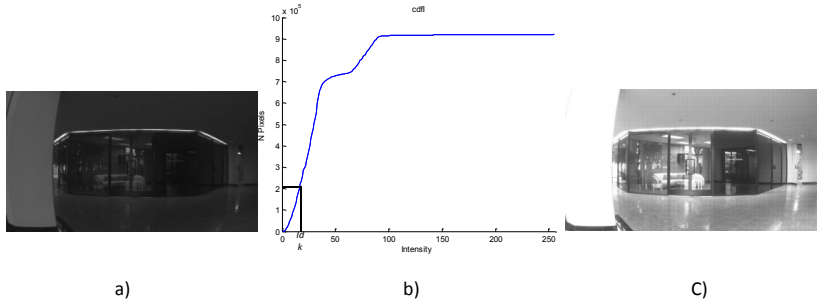
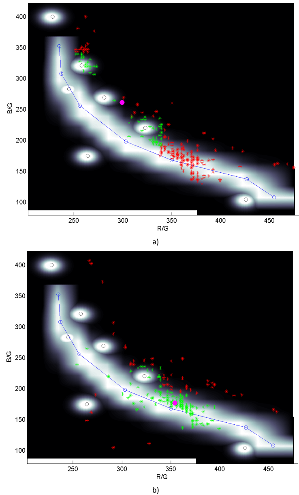
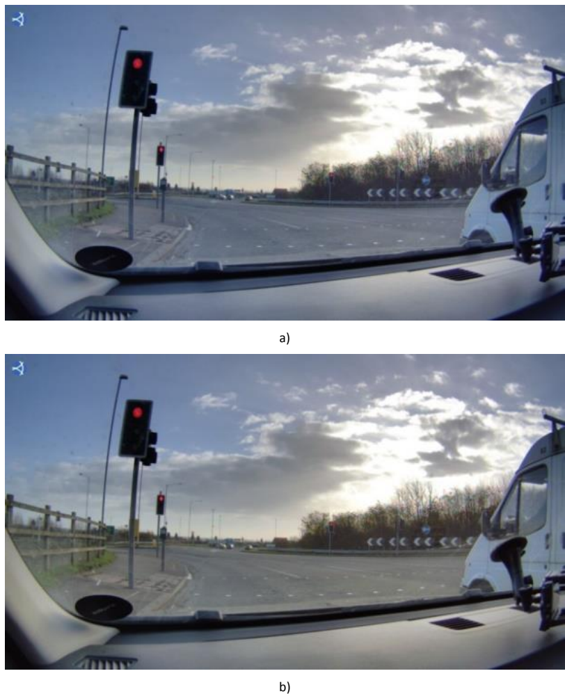

# 数码相机图像质量增强：动态范围与色彩恒常性算法研究

## 一、 研究动机与核心问题

本研究旨在解决数码相机与人类视觉系统（HVS）相比的两个主要短板：

1.  **动态范围不足**：标准成像传感器的动态范围（约60-70dB）远低于人眼（约220dB），导致高对比度场景下亮部过曝或暗部细节丢失。
2.  **色彩恒常性缺失**：相机在不同光源下会产生色偏，而人脑能感知物体固有颜色。现有算法在复杂场景（如单调色、混合光照）下容易失败，且难以同时满足色彩准确性和视觉愉悦度。
3.  **工程实现挑战**：算法需具备低复杂度、低内存占用，以便在图像信号处理器（ISP）中实时处理视频流。

## 二、 核心算法过程梳理

研究提出了三大核心算法模块，均可集成于ISP流水线中，其协同工作关系如下图所示：

### 算法模块一：实时HDR视频的多曝光图像融合

**目标**：通过融合不同曝光的图像扩展动态范围，并有效补偿相机抖动和物体运动引起的“重影”伪影。

**核心流程如下**：

1.  **全局运动估计（补偿相机抖动）**
    *   **输入**：一帧短曝光（`I_s`）和一帧长曝光（`I_l`）的RAW Bayer图像。
    *   **关键步骤**：
        *   **强度均衡化**：通过累积直方图分析，生成二值掩膜（`Imask_dk`, `Imask_br`），使两幅图像在可比强度下进行运动估计。
        *   **运动向量计算**：计算掩膜的行、列向量均值，并通过高斯加权匹配，估算出图像间的全局水平与垂直位移量（`Δ_h`, `Δ_v`）。

2.  **运动感知的图像融合（补偿局部运动）**
    *   **关键步骤**：
        *   **基础融合权重（α图）**：根据计算出的曝光比（ER）和像素邻域亮度，生成初始权重图，决定像素取自 `I_s` 还是 `I_l`。
        *   **运动检测**：计算两幅图像间的绝对差值（`ΔI`）。
        *   **噪声自适应阈值**：利用预先标定的**传感器噪声模型**（噪声轮廓，np）对 `ΔI` 进行阈值处理，区分真实运动与图像噪声，避免误判。`Δ_Inp(x, y) = { 0 if ΔI(x, y) < 1/np(ΔI(x, y)); ΔI(x, y) otherwise }`
        *   **最终融合**：将运动检测结果融入基础α图，生成最终权重。运动区域主要使用短曝光数据以避免重影，非运动区域则进行平滑融合。`I_hdr(x, y) = I_s(x, y) * α(x, y) + (1 - α(x, y)) * I_l(x+Δ_h, y+Δ_v)`

3.  **动态范围压缩**
    *   使用色调映射算法（如Iridix®）将融合后的HDR图像压缩到标准显示设备可呈现的范围。

**算法效果**：该算法能有效消除重影，如下图所示，启用运动补偿后(h)，重影伪影（红箭头处）被成功移除。

### 算法模块二：ISP内的色彩管理系统

**目标**：精确估计光照色温，实现色彩恒常性，并输出令人愉悦的色彩。

**核心流程如下**：

1.  **传感器表征**
    *   在实验室环境下，使用多种标准光源和24色色卡，测量传感器对不同色温的响应，建立其**普朗克轨迹**（R/G, B/G vs. 色温的关系），并确定曝光值（EV）与场景照度（Lux）的关系。

    

2.  **色温估计（AWB模块）**
    *   **输入**：RAW Bayer图像及ISP统计信息（多个区域的R/G, B/G比值）。
    *   **关键步骤**：采用**朴素贝叶斯分类器**。
        *   **先验知识**：高色温常与高亮度、低R/G增益相关；低色温常与低亮度、高R/G增益相关。
        *   **概率计算**：对每个统计区域，计算其属于不同色温类别的概率，并结合其与表征普朗克轨迹的偏离程度进行加权。
        *   **决策**：综合所有区域信息，输出最可能的照明向量 `e = [R_gain, 1, B_gain]^T`。

3.  **色彩校正矩阵（CCM）**
    *   根据估计出的色温，从一组预先生成的CCM（针对D65、TL84、A光源等）中选择或进行插值，应用一个3x3矩阵对图像进行精细色彩平衡，确保色卡颜色准确还原。

    

4.  **冷却- warming效应（增强主观美感）**
    *   依据**Kruithof曲线理论**，对极端色温图像施加轻微色彩偏移（高色温加蓝/冷却，低色温加红/ warming），使色彩更符合人眼偏好。

**算法效果**：该系统能在宽广的色温范围内（16000K至2200K）产生色彩恒定且视觉愉悦的图像。

### 算法模块三：HDR成像中的空间变化色彩恒常性

**目标**：解决HDR场景中因**多光源照明**（如室内灯光与窗外日光混合）而导致的全局色彩平衡失败问题。

**核心流程如下**：

1.  **Illuminant 分割**
    *   **假设**：不同光源照亮的区域具有不同的亮度水平。
    *   **关键步骤**：
        *   通过图像累积直方图，设定阈值将图像分割为**亮部**和**暗部**区域（例如，暗部对应室内光，亮部对应室外光）。
        *   计算一个缩放系数（`rgbg_coeff`），生成一个代表暗部区域特性的虚拟图像。

2.  **空间变化的色温估计**
    *   对**原始图像**和**缩放后的虚拟图像**分别应用算法二的色温估计方法，得到两个照明向量：`e`（主亮部光源）和 `e'`（主暗部光源）。

    
3.  **分段线性色彩校正**
    *   **关键步骤**：
        *   首先，用照明向量 `e` 对整图进行初步白平衡。
        *   然后，根据 `e` 和 `e'` 的增益比，构建一个**分段线性函数**。该函数根据像素的亮度值，动态地混合两种色温的校正效果：暗部像素趋向 `e'`，亮部像素趋向 `e`，中间亮度平滑过渡。
    *   **输出**：最终色彩平衡的图像，其中不同亮度区域根据其主导光源进行了相应校正。

**算法效果**：如下图所示，全局算法(a)在混合光照下暗部出现蓝色调，而空间变化算法(b)使整个场景的色彩恢复自然。

## 三、 算法集成与总结

| 算法模块 | 解决的核心问题 | 关键技术 | 在ISP中的价值 |
| :--- | :--- | :--- | :--- |
| **多曝光图像融合** | 动态范围扩展、运动伪影 | 全局运动估计、噪声模型辅助的运动感知融合 | 实现实时HDR视频录制 |
| **色彩管理系统** | 色彩恒常性、主观色彩愉悦度 | 基于朴素贝叶斯的色温估计、可调CCM、Kruithof曲线 | 在各种光照下输出准确且悦目的照片 |
| **空间变化色彩恒常性** | HDR场景中的多光源色偏 | 基于亮度的图像分割、空间变化色温估计、分段线性校正 | 在复杂光照（如室内外混合光）下实现更自然的色彩平衡 |

这些算法共同构成了一套完整的图像质量增强方案，显著提升了数码相机在动态范围和色彩还原方面的性能，使其更接近人眼的视觉体验。所有算法均设计为硬件友好型，并已在FPGA平台上实现验证，适用于消费电子设备。
