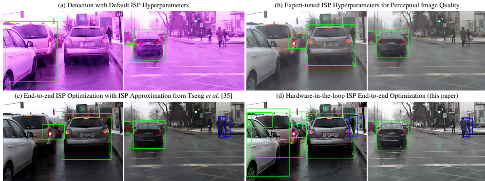
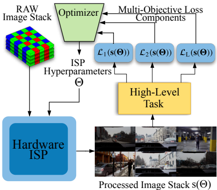

### 一、 研究动机与核心问题

现代成像系统（如手机、自动驾驶汽车）都依赖于硬件图像信号处理器（ISP）将传感器捕获的RAW数据重建为可供人眼观看或机器分析的图像。ISP由一系列处理模块（如白平衡、去马赛克、降噪、锐化等）组成，其行为由数十至数百个超参数（`Θ`）控制。

传统上，这些超参数由成像专家手动调整，以优化**主观图像质量**（如更少的噪声、更悦目的色彩）。然而，这种调整存在两个核心问题：
1.  **与下游任务脱节**：为人类视觉优化的图像，其超参数设置未必对下游的计算机视觉任务（如目标检测、分割）最有利，甚至可能有害。
2.  **优化困难**：ISP超参数空间庞大、参数间耦合复杂（非线性、非凸、甚至存在离散参数），使得手动或传统的自动优化方法（如网格搜索）难以进行。

近期研究尝试通过软件模拟ISP并使用基于梯度的一阶方法进行优化，但模拟器与真实硬件之间存在**域差异**，且优化过程容易陷入局部最优。

**因此，本研究的核心动机是**：提出一种能够**直接与真实硬件ISP交互**的端到端优化方法，自动寻找能使特定下游任务（如目标检测的mAP）性能最优的超参数组合，打破为人类视觉调参的局限。

### 二、 核心算法过程：硬件在环端到端优化

该研究将ISP超参数优化定义为一个**多目标黑盒优化问题**，并提出了一个基于改进的协方差矩阵自适应进化策略（CMA-ES）的解决方案。其核心算法流程如下图所示：

整个优化过程可以分解为以下几个关键步骤：

#### 1. 问题建模

将ISP建模为一个函数 `f`，它将RAW图像 `I` 和超参数 `Θ` 映射为输出图像 `O`：
$$f:R^{W\times H}\times R^{P}_{[0,1]}\rightarrow R^{W\times H\times 3},\quad(I,\Theta)\mapsto O$$

优化目标是找到一组超参数 `Θ*`，使得在由 `S` 张RAW图像组成的输入栈上，ISP输出的图像栈 `s(Θ)` 能最小化一个由 `L` 个损失函数组成的向量 `ℒ(Θ)`：
$$\Theta^*=\underset{\Theta\in R_{[0,1]}^{P}}{\operatorname{argmin}}\mathcal{L}(\Theta):=\underset{\Theta\in R_{[0,1]}^{P}}{\operatorname{argmin}}\left(\mathcal{L}_1(s(\Theta)),\ldots,\mathcal{L}_{L}(s(\Theta))\right)$$

其中，每个损失函数 `ℒ_l` 对应一个下游任务的评估指标（如mAP的负值）。

#### 2. 搜索空间预热（Search Space Reduction）

在启动主优化算法前，先进行搜索空间预热，这是一个关键的预处理步骤。
*   **目的**：识别出对损失函数有积极影响的超参数范围，缩小搜索空间，并为CMA-ES提供一个更好的初始点 `Θ^(0)`。
*   **过程**：
    1.  在原始超参数空间中进行**近似拉丁超立方采样**。
    2.  对每个超参数，利用统计检验（如Kolmogorov-Smirnov检验）分析其取值与损失值之间的依赖性。
    3.  对于每个超参数，将其取值范围缩小到那些在表现最好的 `q%` 样本中出现的区间。
    4.  构建一个三次样条函数，将缩小后的区间映射回原始的单位区间 `[0,1]`，确保整个空间仍可达，使优化器能从有偏的初始分析中恢复。

#### 3. 基于CMA-ES的主优化循环

算法核心是一个改进的CMA-ES流程，其伪代码如下所示。它通过多代进化来搜索最优超参数。

**算法 1 ISP超参数优化方法**
| 行号 | 操作 |
| :--- | :--- |
| 1 | **Require:** 初始超参数 `Θ^(0)`, 每代个体数 `λ`, 最大迭代次数 `N_iter` |
| 2 | 初始化CMA-ES状态，设当前代 `t = 1` |
| 3 | **while** 停止准则未满足且 `t ≤ N_iter` **do** |
| 4 | | **for** `j = 1` to `λ` **do** |
| 5 | | | 从以当前中心 `Θ` 为均值的高斯分布中随机抽取个体 `Θ_j^(t)` |
| 6 | | | 向 `Θ_j^(t)` 添加随机噪声（防止离散参数卡死） |
| 7 | | | 通过反射将 `Θ_j^(t)` 映射回单位超立方体内 |
| 8 | | | **硬件在环评估**：将 `Θ_j^(t)` 配置到真实ISP，处理RAW图像栈 `I_1, ..., I_S`，得到输出图像栈 `s(Θ_j^(t))` |
| 9 | | | 计算该个体的多目标损失向量 `(ℒ_1(s(Θ_j^(t))), ..., ℒ_L(s(Θ_j^(t))))` |
| 10 | | **end for** |
| 11 | | 基于本代所有个体的表现，更新CMA-ES状态（包括分布均值和协方差矩阵），`t = t + 1` |
| 12 | **end while** |
| 13 | **return** 找到的最优超参数 `Θ` |

#### 4. 多目标处理的创新：动态加权最大秩损失（Dynamic Weighted Max-rank Loss）

标准CMA-ES是为单目标优化的。为了处理多目标问题，本研究提出了一个新颖的**标量化**方法。
*   **目的**：将多目标损失向量转换为一个标量值，以便CMA-ES能够排序和选择。
*   **过程**：
    1.  **计算秩**：对于当前代和之前所有代的个体，针对**每个损失分量 `ℒ_l`** 单独计算每个个体的秩（`rank`）。表现越好（损失值越小），秩越小。
    2.  **加权最大秩**：对于每个个体 `j`，其标量损失 `ℳ_j` 计算为所有损失分量秩的加权最大值：
        `ℳ_j = max_{l∈{1,...,L}} w_l * rank(ℒ_l(Θ_j))`
    3.  **动态权重调整**：权重 `w_l` 不是固定的，而是在每代结束时根据近期世代中达到目标损失值（例如，满足性能阈值）的个体比例进行动态调整。这使优化过程能够自适应地关注那些尚未被很好优化的目标。

#### 5. 帕累托前沿选择（Pareto Front Selection）

在主优化循环结束后，算法对所有评估过的个体进行**帕累托排序**。帕累托前沿上的解代表了一系列最优的权衡方案（例如，提升某个任务的性能可能会以轻微降低另一个任务的性能为代价）。最终，研究者可以从这个前沿中根据实际需求选择一个“冠军”解。

### 三、 算法优势总结

所提出的硬件在环端到端优化方法的核心优势在于：
*   **真实性**：直接与硬件ISP交互，避免了软件模拟器带来的域差异问题。
*   **通用性**：作为黑盒优化器，不需要了解ISP内部细节，适用于商用闭源ISP。
*   **鲁棒性**：基于CMA-ES的零阶优化方法能够处理非线性、非凸、非可微的损失函数和包含离散参数的搜索空间。
*   **多功能性**：通过多目标优化框架，可以同时为多个（可能冲突的）任务寻找最佳权衡点。

通过上述流程，该研究成功地将硬件ISP变为一个可编程的、面向任务性能优化的组件，为计算摄影和计算机视觉系统的联合设计开辟了新的道路。
